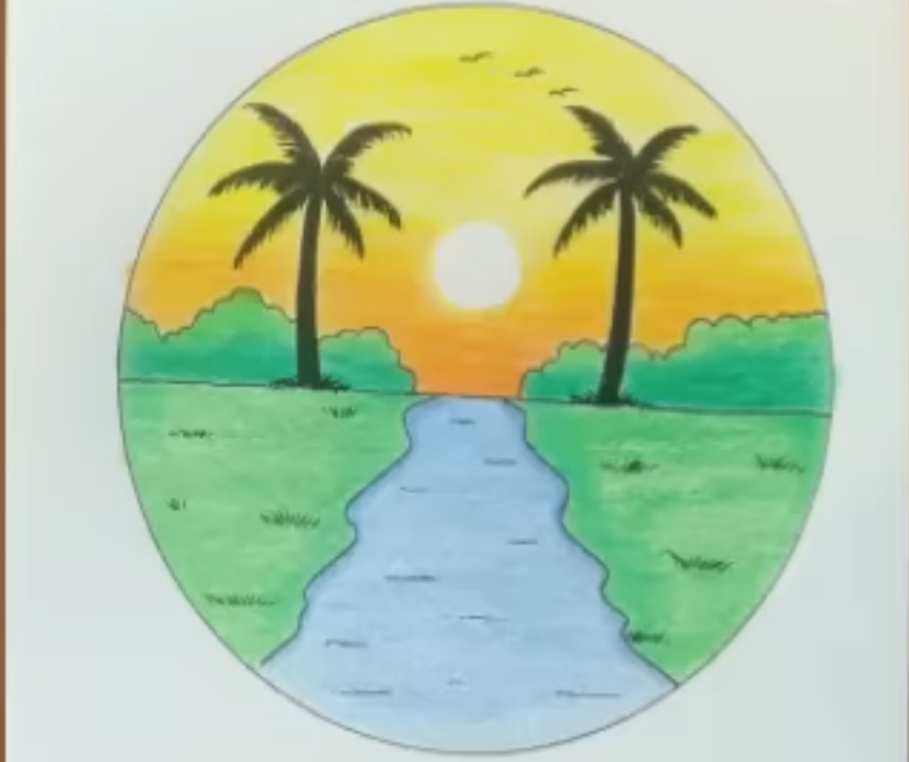

<!DOCTYP

<!-- مربع القائمة -->

<button onclick="openMenu()" style="
font-size:30px;
background:none;
border:none;
color:white;
cursor:pointer;
">
☰
</button>

<!-- القائمة -->

<a href="javascript:void(0)"
onclick="closeMenu()"
style="
position:absolute;
top:10px;
left:15px;
font-size:35px;
color:white;
text-decoration:none;
">
×
</a>

<!-- منصاتنا -->
<button onclick="togglePlatforms()" style="
width:100%;
padding:15px;
font-size:22px;
background:none;
border:none;
color:white;
text-align:right;
cursor:pointer;
">
📱 منصاتنا ▼
</button>

<a href="https://www.tiktok.com/@user31912672754551?_r=1&_t=ZS-96bCnHsMDCa"
target="_blank"
style="display:block;padding:12px 30px;color:white;text-decoration:none;">
تيك توك
</a>

<a href="https://youtube.com/@alislamiah5195?si=8GwSs2q4DnD-JOMf"
target="_blank"
style="display:block;padding:12px 30px;color:white;text-decoration:none;">
يوتيوب
</a>

<a href="https://whatsapp.com/channel/0029VbCd4APEawdpGuhPeA0G"
target="_blank"
style="display:block;padding:12px 30px;color:white;text-decoration:none;">
واتساب
</a>

<a href="https://t.me/alislamiahmo45"
target="_blank"
style="display:block;padding:12px 30px;color:white;text-decoration:none;">
تيليجرام
</a>

<!-- دروسنا -->
<button onclick="toggleLessons()" style="
width:100%;
padding:15px;
font-size:22px;
background:none;
border:none;
color:white;
text-align:right;
cursor:pointer;
">
📚 دروسنا ▼
</button>

<a href="#lesson1"
style="display:block;padding:12px 30px;color:white;text-decoration:none;">
If Conditional
</a>

<a href="#lesson2"
style="display:block;padding:12px 30px;color:white;text-decoration:none;">
Despite and Inspite Of
</a>

<a href="#lesson3"
style="display:block;padding:12px 30px;color:white;text-decoration:none;">
Linking Words
</a>

<a href="#lesson4"
style="display:block;padding:12px 30px;color:white;text-decoration:none;">
Tenses
</a>

<!-- الخلفية -->
<button onclick="toggleBackgrounds()" style="
width:100%;
padding:15px;
font-size:22px;
background:none;
border:none;
color:white;
text-align:right;
cursor:pointer;
">
🎨 الخلفية ▼
</button>

<button onclick="whiteTheme()" style="
width:100%;
padding:12px 30px;
background:none;
border:none;
color:white;
text-align:right;
cursor:pointer;
font-size:18px;
">
⚪ أبيض
</button>

<button onclick="blueTheme()" style="
width:100%;
padding:12px 30px;
background:none;
border:none;
color:white;
text-align:right;
cursor:pointer;
font-size:18px;
">
🔵 أزرق داكن
</button>

<!-- حقوق النشر -->

© جميع حقوق النشر محفوظة لدى الإسلامية

  <button onclick="  
document.body.style.background='white';  
document.body.style.color='black';  
"  
style="  
min-width:100px;  
background:none;  
border:none;  
color:white;  
font-size:18px;  
cursor:pointer;  
flex:none;  
">
أبيض
</button>

<button onclick="  
document.body.style.background='#2d3550';  
document.body.style.color='white';  
"  
style="  
min-width:100px;  
background:none;  
border:none;  
color:white;  
font-size:18px;  
cursor:pointer;  
flex:none;  
">
أزرق
</button>

<button onclick="
window.location.href='https://youtube.com/@alislamiah5195?si=9mSLKzXpiq_XVCTN';
" 
style="
min-width:100px;
background:none;
border:none;
color:white;
font-size:18px;
cursor:pointer;
flex:none;
">
يوتيوب
</button>

<button onclick="  
window.location.href='https://whatsapp.com/channel/0029VbCd4APEawdpGuhPeA0G';  
"  
style="  
min-width:100px;  
background:none;  
border:none;  
color:white;  
font-size:18px;  
cursor:pointer;  
flex:none;  
">
واتساب
</button>

<button onclick="  
window.location.href='https://www.tiktok.com/@user31912672754551?_r=1&_t=ZS-96LucWHJg5x';  
"  
style="  
min-width:100px;  
background:none;  
border:none;  
color:white;  
font-size:18px;  
cursor:pointer;  
flex:none;  
">
تيك توك
</button>

<button onclick="  
window.location.href='https://t.me/alislamiahmo45';  
"  
style="  
min-width:100px;  
background:none;  
border:none;  
color:white;  
font-size:18px;  
cursor:pointer;  
;  
">
تيليجرام
</button>

  

<video controls width="100%" style="
border-radius:15px;
margin-top:20px;
">
  <source src="IMG_20260526_063459_202.mp4" type="video/mp4">
</video>

<video controls width="100%" style="
border-radius:15px;
margin-top:20px;
">
  <source src="VID_20260528_110617_560.mp4" type="video/mp4">
</video>

<h1>مرحبا بكم في موقعي</h1>

أود أن أتفضل بالتعريف عن هذا الموقع: هذا موقع لعرض 
    الدروس الخصوصية و الدعم في مادة اللغة الإنجليزية لتلاميذ الباكالوريا 

    

<button onclick="
window.scrollTo({top:0,behavior:'smooth'})
">
🏠الرئيسية
</button>

<button onclick="toggleSearch()">
🔍البحث
</button>

<button onclick="toggleRating()">
⭐قيمنا
</button>

<button onclick="window.location.href='video.html'">
🎥 فيديو
</button>

<input id="searchInput"
onkeyup="searchLesson()"
placeholder="بحث..."
style="width:100%;padding:10px;">

التقييم:

★
★
★
★
★

0/5

video c<ontrols width="100%" style="
border-radius:15px;
margin-top:20px;
">
  <source src="VID_20260528_110617_560.mp4" type="video/mp4">
</video>

<h2>نماذج شعبة آداب و فلسفة </h2>

<button onclick="window.open('https://www.dzexams.com/uploads/sujets/officiels/bac/2020/dzexams-bac-anglais-1829145.pdf','_blank')"
style="padding:10px 20px;flex:none;">
نموذج 1
</button>

<button onclick="window.open('https://www.dzexams.com/uploads/sujets/officiels/bac/2021/dzexams-bac-anglais-1402187.pdf','_blank')"
style="padding:10px 20px;flex:none;">
نموذج 2
</button>

<button onclick="window.open('https://www.dzexams.com/uploads/sujets/officiels/bac/2022/dzexams-bac-anglais-1632419.pdf','_blank')"
style="padding:10px 20px;flex:none;">
نموذج 3
</button>

<button onclick="window.open('https://www.dzexams.com/uploads/sujets/officiels/bac/2023/dzexams-bac-anglais-206010.pdf','_blank')"
style="padding:10px 20px;flex:none;">
نموذج 4
</button>

<button onclick="window.open('https://www.dzexams.com/uploads/sujets/officiels/bac/2024/dzexams-bac-anglais-1096571.pdf','_blank')"
style="padding:10px 20px;flex:none;">
نموذج 5
</button>

<h2>شعبة العلوم التجريبية </h2>

<button onclick="window.location.href='https://www.dzexams.com/ar/annales/U0ZGY2VRekl4TG82UlhWZTc3NW93Zz09'">
نموذج 1
</button>

<button onclick="window.location.href='https://www.dzexams.com/ar/annales/MWhaY3hYUFRyN0ltMjhUcUZ3c1BQdz09'">
نموذج 2
</button>

<button onclick="window.location.href='https://www.dzexams.com/ar/annales/b2xNckxQSyszS01UcVhvZmsrYXozZz09'">
نموذج 3
</button>

<button onclick="window.location.href='https://www.dzexams.com/ar/annales/U1oyS2dkMU5kcnN1TzVTZ0FJTjlDQT09'">
نموذج 4
</button>

<button onclick="window.location.href='https://www.dzexams.com/ar/annales/Lys1Rk5MOW1sbGxmRXRzUTVjME5OUT09'">
نموذج 5
</button>

<h2>نماذج شعبة لغات أجنبية </h2>

<button onclick="window.location.href='https://www.dzexams.com/ar/annales/WHNGRGtCUm9kS0VBWEpkc3lvMC9nQT09'"
style="flex:none;min-width:120px;padding:10px;">
نموذج 1
</button>

<button onclick="window.location.href='https://www.dzexams.com/ar/annales/a0ZRWVBKWk9CdFp1a0owbTYyenBSUT09'"
style="flex:none;min-width:120px;padding:10px;">
نموذج 2
</button>

<button onclick="window.location.href='https://www.dzexams.com/ar/annales/NW1xNW1DZkd5Ry9IMnN5djdmNllmZz09'"
style="flex:none;min-width:120px;padding:10px;">
نموذج 3
</button>

<button onclick="window.location.href='https://www.dzexams.com/ar/annales/eGN4V1lrelVEeEIzelo3UGpBYlkrQT09'"
style="flex:none;min-width:120px;padding:10px;">
نموذج 4
</button>

<button onclick="window.location.href='https://www.dzexams.com/ar/annales/eUdYNUJabEYzdDREci85bGxDM3Fzdz09'"
style="flex:none;min-width:120px;padding:10px;">
نموذج 5
</button>

<button onclick="window.location.href='https://www.dzexams.com/ar/annales/WUtCOFhUME84OVMzSWEzM3hNN3JuUT09'"
style="flex:none;min-width:120px;padding:10px;">
نموذج 6
</button>

<h1 style="text-align:center;">
قائمة الدروس
</h1>

<button onclick="document.getElementById('lesson1').scrollIntoView();"
style="
min-width:180px;
color:white;
background:none;
border:none;
font-size:18px;
flex:none;
cursor:pointer;
">
Lesson 1
</button>

<button onclick="document.getElementById('lesson2').scrollIntoView();"
style="
min-width:180px;
color:white;
background:none;
border:none;
font-size:18px;
flex:none;
cursor:pointer;
">
Lesson 2
</button>

<button onclick="document.getElementById('lesson3').scrollIntoView();"
style="
min-width:180px;
color:white;
background:none;
border:none;
font-size:18px;
flex:none;
cursor:pointer;
">
Lesson 3
</button>

<button onclick="document.getElementById('lesson4').scrollIntoView();"
style="
min-width:180px;
color:white;
background:none;
border:none;
font-size:18px;
flex:none;
cursor:pointer;
">
Lesson 4
</button>

<h1 style="
margin-bottom:15px;
font-size:28px;
">
تطبيق Alislamiah APK
</h1>

بإمكانكم تحميل تطبيق Alislamiah APK 
على هواتفكم

<button onclick="window.location.href='https://drive.google.com/uc?export=download&id=15hOi8LjfDD9S1SXmFeA4IGVksbpbz3nD'"
style="
padding:15px 30px;
background:#22c55e;
color:white;
border:none;
border-radius:12px;
font-size:18px;
cursor:pointer;
font-weight:bold;
">
تحميل التطبيق
</button>

جميع الحقوق محفوظة لشبكة الإسلامية ©

  

<h2 style="
color:white;
font-size:40px;
margin-bottom:30px;
">
إحصائياتنا
</h2>

<!-- YouTube -->

0

مشترك

<!-- TikTok -->

0

متابع

<h2 id="lesson1">
Lesson one: if conditional
</h2>

<h2>Lesson 1: If conditional</h2>

I look

<b>Mohamed:</b> what will you wear tomorrow?

<b>Abdel Malik:</b> I will wear a jacket because it's rainy and the weather is very cold ❄️🥶

<h3>The rule:</h3>

There are four types of the conditional

<h3>First: type 0</h3>

It's used to explain scientific facts and everything here happens 100%.

Example: If it is hot, ice melts.

In this type we use the present simple in both sentences.

<h3>Second: type 1</h3>

This type talks about something possible in the future (about 80%).

Example: If you work hard, you will succeed.

In this type we use the present simple after if and the future simple in the second sentence.

<h3>Third: type 2</h3>

This type talks about unreal or imaginary situations.

Example: If I were you, I would open the store.

In this type we use the past simple in the first sentence and would + verb in the second sentence.

<h3>Fourth: type 3</h3>

This type talks about impossible situations in the past.

Example: If this player had played with us, we would have won the match.

<h3>Unless</h3>

We use it like if, but it means if not.

Example:

If you work hard, you won't fail.

Unless you work hard, you will fail.

That's all in this lesson.

<h2 id="lesson2">
Despite and inspite of
</h2>

<h2>Lesson 2: Despite and In spite of</h2>

Despite and In spite of mean:
(رغم / بالرغم من)

<h3>Rule:</h3>

After Despite / In spite of, the verb becomes ING.

Play → Playing

Eat → Eating

Win → Winning

<h3>Example:</h3>

Algeria won vs Argentina. Messi is number one.

Despite Algeria winning vs Argentina, Messi is number one.

The same with In spite of.

<h3>Similar words:</h3>

Although

Though

However

These words have similar meanings but the verb stays normal.

<h3>Example:</h3>

This city is freezing 🥶, I enjoyed it though.

<h2 id="lesson3">
Linking words
</h2>

<h2>Lesson 3: Linking words</h2>

Linking words are words used to connect ideas.

<h3>1. Addition</h3>

and

also

in addition

moreover

Example: I study and I work.

Moreover, I exercise daily.

<h3>2. Cause</h3>

because

since

as

Example: I stayed home because it rained.

<h3>3. Result</h3>

so

therefore

as a result

Example: It was late, so I slept.

<h3>4. Contrast</h3>

but

however

although

despite

Example: I am tired, but I will work.

However, I agreed.

<h3>5. Sequence</h3>

first

then

after that

finally

Example: First, I wake up. Then I study.

<h2 id="lesson4">
Tenses
</h2>

<h3>1. Present simple</h3>

I / You / We / They → verb

He / She / It → verb + s

Example: I wake up early.

<h3>Verbs ending with:</h3>

x / o / s / ss / sh / ch

He / She / It → verb + es

<h3>Verbs ending with y</h3>

If there is a vowel before y:

play → plays

If there is a consonant before y:

study → studies

<h3>2. Future simple</h3>

Will + verb

<h3>3. Past simple</h3>

Regular verbs:
verb + ed

Irregular verbs:
special forms

<h3>4. Present perfect</h3>

Have / Has + past participle

Regular verbs:
verb + ed

<h2>PAST PERFECT</h2>

To form the past perfect: had + past participle

<h3>IRREGULAR VERBS</h3>

In the past simple and the past participle there are some irregular verbs such as:

Write ✍️ → Wrote → Written

Sleep → Slept → Slept

Eat → Ate → Eaten

<h3>5. Present continuous</h3>

To be + verb + ing

<h3>6. Past continuous</h3>

Was / Were + verb + ing

